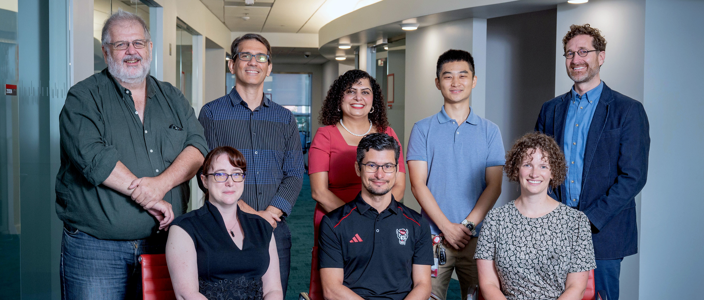

<head>
    
</head>
<body>
    <!-- Container -->
    

        <!-- Image -->
        

            
        

        <!-- Text and Image -->
        

            

                <h1>Software Engineering at NCSU</h1>
                
Accelerate your SE career, in industry, in research.

            

            
        

    

    <!-- News Section -->
    

            

                <h1>News</h1>
                <ul>
                    <li>
                        10/2023, <strong>Dr. Marcelo D'Amorim is serving FSE 2024 as the General Chair!</strong>
                        <ul>
                            Please consider participate the <i>ACM Joint European Software Engineering Conference and Symposium on the Foundations of Software Engineering</i> (ESEC/FSE)! See you at Porto de Galinhas, Brazil! <a href="https://2024.esec-fse.org/">More Details</a>
                        </ul>
                    </li>
                    <li>
                        10/2023, <strong>Dr. Sandeep Kuttal gave a keynote at SCAM and VISSOFT 2023!</strong>
                        <ul>
                            Great job from Dr. Sandeep Kuttal! The talk is titled <i>IDEs as the Bridge: Connecting Humans and Code</i> at the IEEE International Working Conference on Source Code Analysis &amp; Manipulation (SCAM) and on Software Visualization (VISSOFT). Bogotá, Colombia, October 2023. <a href="https://sandeepkuttal.github.io/kuttal/index.html">More Details</a>
                        </ul>
                    </li>
                    <li>
                        10/2023, <strong>Our student Leon Shahnewaz (supervised by Dr. Sandeep Kuttal) presented a paper at VLHCC 2023!</strong>
                        <ul>
                            Congratulations to our students Leon Shahnewaz, Mahzabin Tamanna, and Dr. Sandeep Kuttal! The paper is titled <i>Comparing Foraging Behavior Across Code Hosting and Q&amp;A Platforms through a Gender Lens</i> at IEEE Symposium on Visual Languages and Human-Centric Computing (VLHCC). Washington, DC, USA. <a href="https://sandeepkuttal.github.io/kuttal/index.html">More Details</a>
                        </ul>
                    </li>
                    <li>
                        09/2023, <strong>Dr. Tim Menzies was designated ASE Fellow!</strong>
                        <ul>
                            Congratulations to Dr. Tim Menzies! He was designated a Fellow of Automated Software Engineering at the 38th IEEE/ACM International Conference on Automated Software Engineering (ASE). <a href="https://timm.fyi/">More Details</a>
                        </ul>
                    </li>
                    <li>
                        09/23, <strong>Dr. Wesley K. G. Assunção Won Best Paper Award at SPLC 2023!</strong>
                        <ul>
                            Congratulations to Dr. Wesley K. G. Assunção and his co-authors from the Federal University of Paraná, on recently winning the Best Research Paper award at the 27th ACM International Systems and Software Product Line Conference (SPLC). <a href="https://wesleyklewerton.github.io/">More Details</a>
                        </ul>
                    </li>
                </ul>
            

    

</body>
